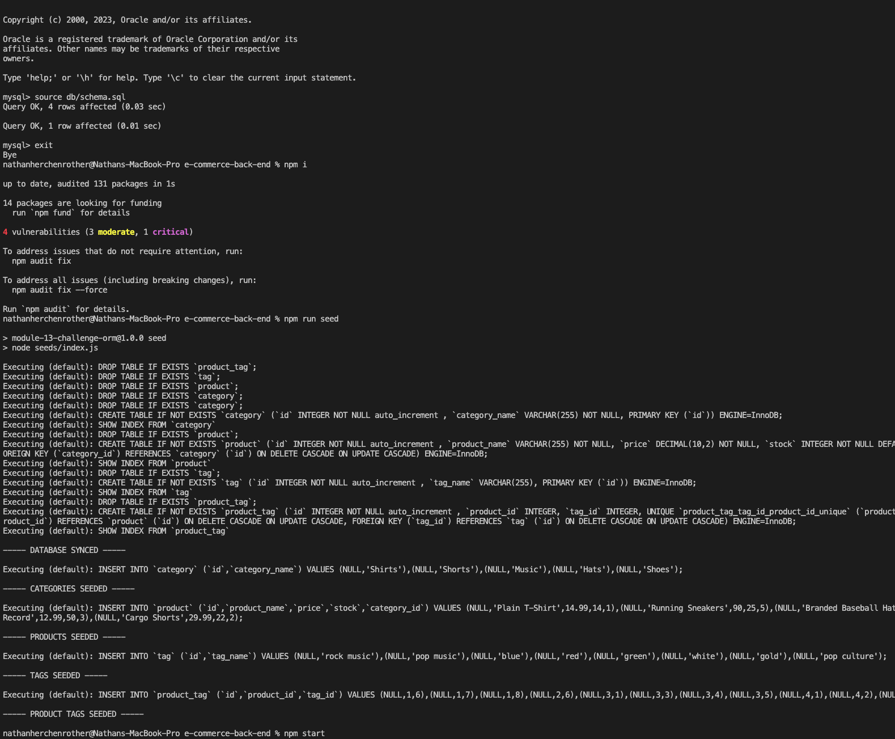
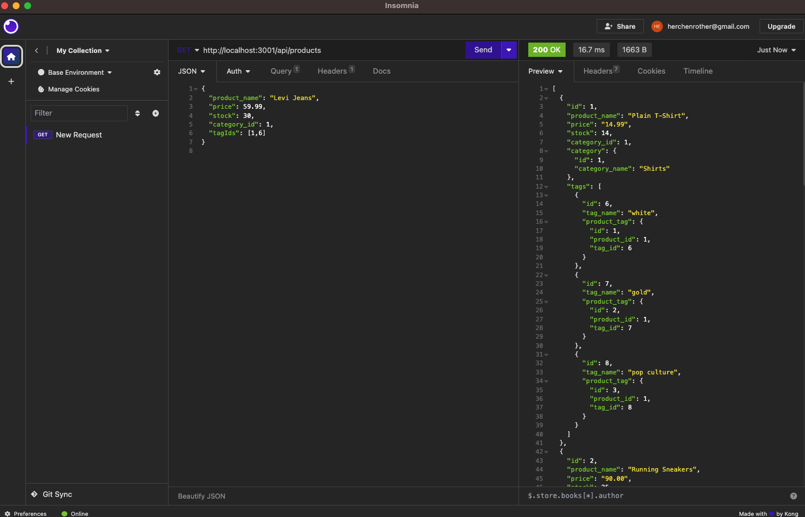
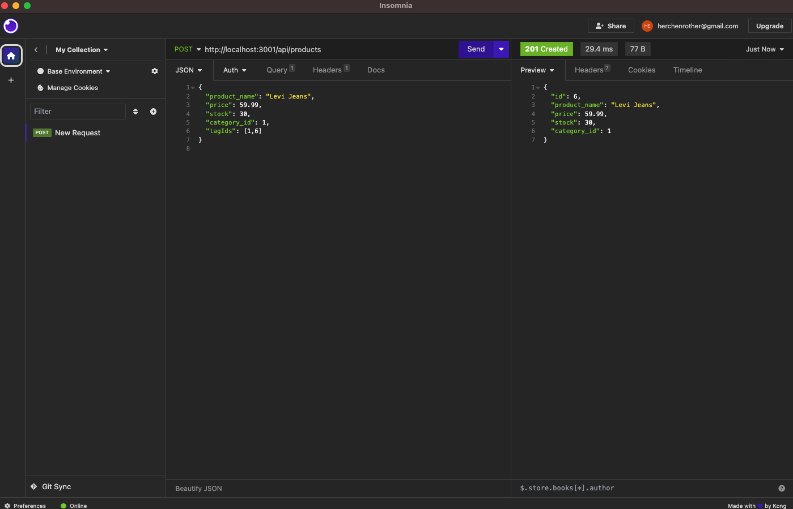
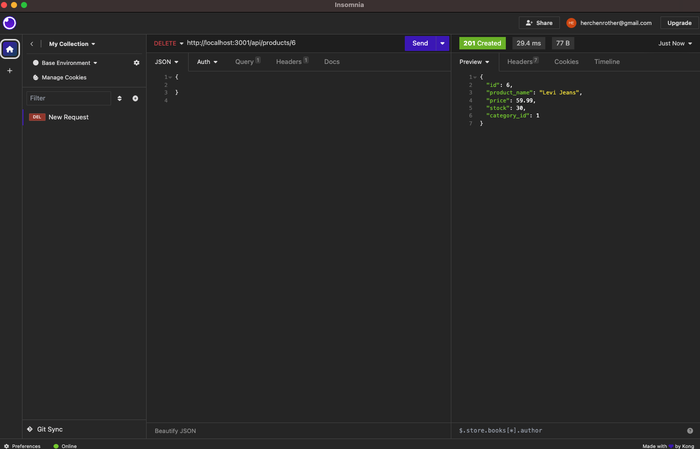

# E-commerce Back End Starter Code

## Description

- My motivation behind this project was to create an interactive prompt to track and maintain stock for an e-commerce site through a database.
- I built this project to help users easily manipulate data for stock, including price, name, and quantity. 
- This allows for an easy way for users to update data in order to add, delete or modify items in a database.  They can change the names, prices, and quantities as well.
- I learned how to use sequelize and express to form a working database with routes to manipulate that data.    

## Table of Contents 

- [Installation](#installation)
- [Usage](#usage)
- [License](#license)

## Installation

The application is started by typing "git clone https://github.com/hershrva/ecommerce-back-end.git" into the users Visual Studio Code or any CLI for running Git commands in a new directory.  The user should then install mysql and insomnia if not already installed.

## Usage

The application works by running "mysql -u root" in the command line after cloning the repository.  After entering mysql the user should enter "SOURCE db/schema.sql;" to create the database and tables. The user should then exit by typing in "exit" while in mysql and then type in "npm i", "npm run seed", and "npm start" to the command line in the terminal while in the main folder.(Screenshot #1).  The program will start allowing the user to access the database and manipulate the data tables for products, categories, and tags in insomnia by entering "http://localhost:3001/api/(tags,products or categories)".(Screenshot #2)  They can get or add by using those URLs. In order to add they just need to specify the data they want to add with tags being:
{
  "tag_name": "Example Tag"
}

categories:
{
  "category_name": "Example Category"
}

and products:
{
  "product_name": "Example Product",
  "price": 29.99,
  "stock": 100, 
  "category_id": 1,
  "tagIds": [1,2]
}

The user can delete and modify data in the tables by specifying the product, tag, or category they want to modify by using the id at the end of the URL(example: "http://localhost:3001/api/tags/1) (Screenshots #3 and #4) 

A video demonstration can be found here: https://drive.google.com/file/d/18g5eCc89NGLQAZnaoGmHw4EqiqoR2FGe/view

## License

MIT License

Copyright (c) 2023 hershRVA

Permission is hereby granted, free of charge, to any person obtaining a copy
of this software and associated documentation files (the "Software"), to deal
in the Software without restriction, including without limitation the rights
to use, copy, modify, merge, publish, distribute, sublicense, and/or sell
copies of the Software, and to permit persons to whom the Software is
furnished to do so, subject to the following conditions:

The above copyright notice and this permission notice shall be included in all
copies or substantial portions of the Software.

THE SOFTWARE IS PROVIDED "AS IS", WITHOUT WARRANTY OF ANY KIND, EXPRESS OR
IMPLIED, INCLUDING BUT NOT LIMITED TO THE WARRANTIES OF MERCHANTABILITY,
FITNESS FOR A PARTICULAR PURPOSE AND NONINFRINGEMENT. IN NO EVENT SHALL THE
AUTHORS OR COPYRIGHT HOLDERS BE LIABLE FOR ANY CLAIM, DAMAGES OR OTHER
LIABILITY, WHETHER IN AN ACTION OF CONTRACT, TORT OR OTHERWISE, ARISING FROM,
OUT OF OR IN CONNECTION WITH THE SOFTWARE OR THE USE OR OTHER DEALINGS IN THE
SOFTWARE.

